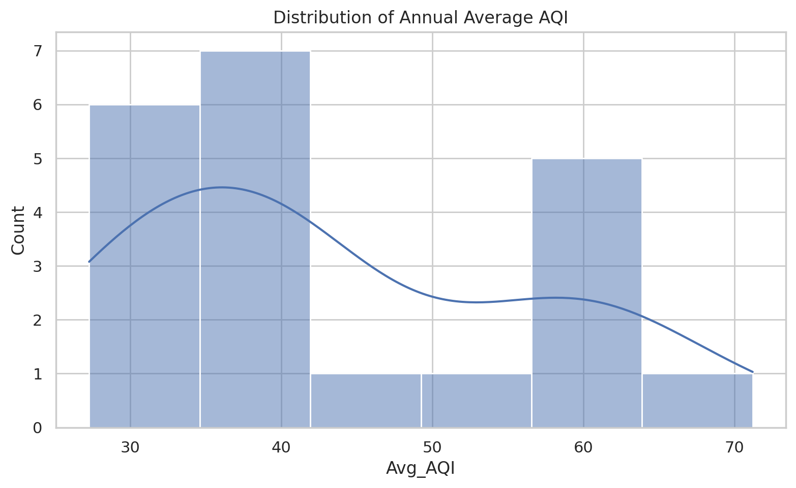
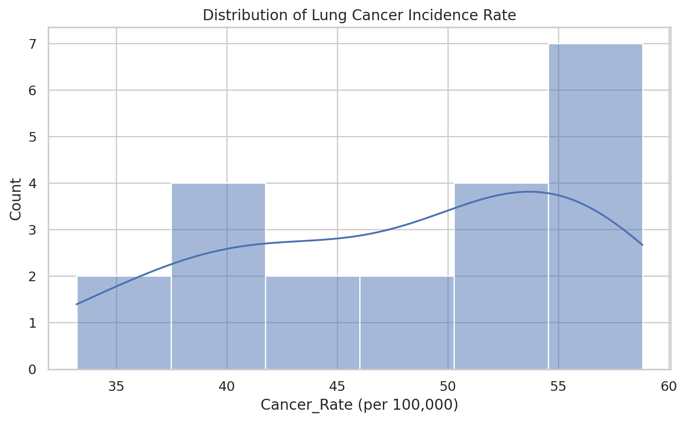
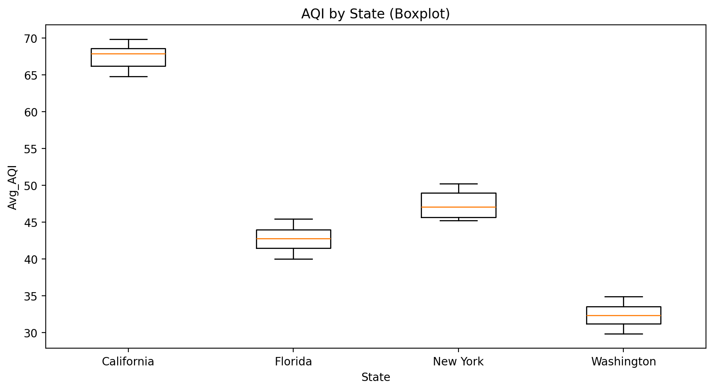
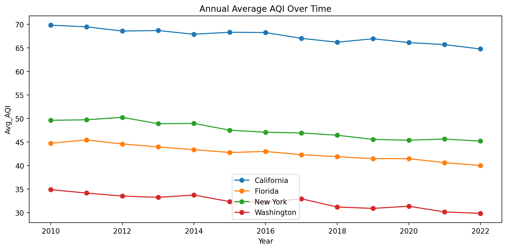
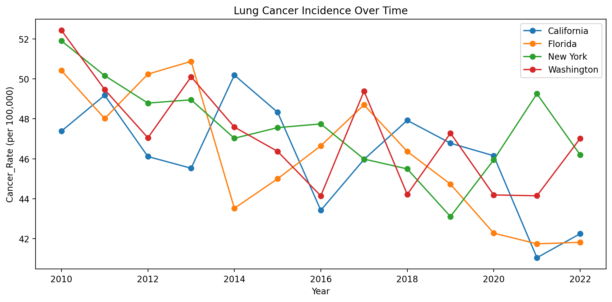
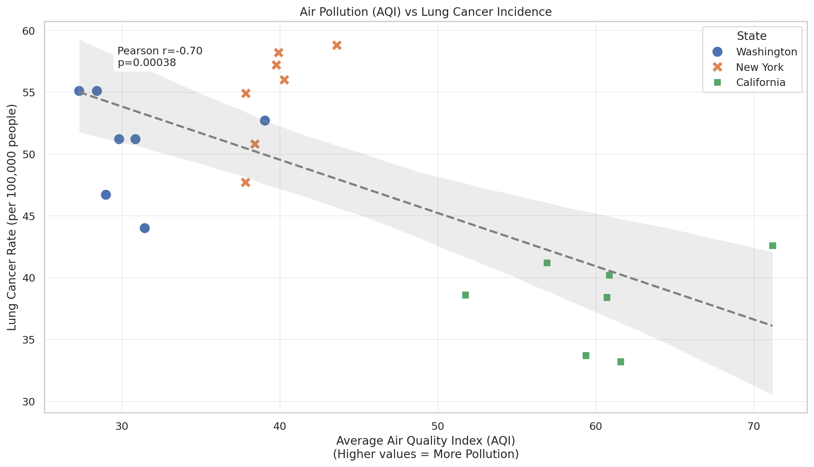

# DSA210 – Air Pollution (AQI) and Lung Cancer Incidence  
**Exploratory Data Analysis and Correlation Study**

This project analyzes the relationship between **air pollution**, measured using **annual average Air Quality Index (AQI)**, and **lung cancer incidence rates** across selected U.S. states. The study follows a structured data science workflow including **data preprocessing**, **exploratory data analysis (EDA)**, and **statistical hypothesis testing**.

---

## Research Question

**Is there a statistically significant relationship between annual average air pollution (AQI) and lung cancer incidence rates across U.S. states and years?**

---

## Hypothesis

- **H₀ (Null Hypothesis):** There is no statistically significant linear relationship between annual average AQI and lung cancer incidence rates (ρ = 0).
- **H₁ (Alternative Hypothesis):** There is a statistically significant linear relationship between annual average AQI and lung cancer incidence rates (ρ ≠ 0).

Significance level: **α = 0.05**

---

## Data Sources

- **Air Quality Data:**  
  Environmental Protection Agency (EPA) – Air Quality System (AQS)  
  [https://www.epa.gov/aqs](https://www.epa.gov/aqs)

- **Cancer Incidence Data:**  
  Centers for Disease Control and Prevention (CDC) – U.S. Cancer Statistics  
  [https://www.cdc.gov/cancer/uscs/](https://www.cdc.gov/cancer/uscs/)

*Note: The dataset currently included in this repository (`data/`) is a **synthetic proxy** generated to demonstrate the pipeline's functionality, as the original study data was not redistributable. For scientific reproduction, please download the official state-level annual summaries from the sources above.*

---

## Data Preprocessing

Before analysis, several preprocessing steps were applied:

- Column names were standardized and dates were parsed into year format
- AQI values and cancer incidence rates were converted to numeric values
- Rows with missing or invalid year/value entries were removed
- Air quality data was aggregated into **annual average AQI**
- Datasets were merged using **State** and **Year** as keys

These steps ensured consistency and reliability before conducting exploratory and statistical analysis.

---

## Exploratory Data Analysis (EDA)

### Distribution of Annual Average AQI

This histogram shows the distribution of annual average AQI values across all states and years. It provides an overview of pollution levels and helps identify variability and potential skewness.



**Interpretation:**  
Most AQI values fall within moderate ranges, while higher AQI values appear less frequently and are primarily associated with California.

---

### Distribution of Lung Cancer Incidence Rate

This histogram presents the distribution of lung cancer incidence rates (per 100,000 people) across the dataset, highlighting the spread and variability of cancer rates.



**Interpretation:**  
Cancer incidence rates vary considerably across states and years, with higher rates more common in densely populated regions.

---

### AQI by State (Boxplot)

This boxplot compares the distribution of annual average AQI values between states, highlighting differences in pollution levels and potential outliers.



**Interpretation:**  
California shows consistently higher AQI values compared to Washington and New York, indicating relatively poorer air quality during the analyzed period.

---

## Temporal Trends

### Annual Average AQI Over Time

This line plot shows how annual average AQI values change over time for each state, allowing comparison of pollution trends.



**Interpretation:**  
Washington and New York display relatively stable AQI trends, while California maintains higher pollution levels with noticeable year-to-year variation.

---

### Lung Cancer Incidence Over Time

This line plot illustrates lung cancer incidence rates over time for each state.



**Interpretation:**  
All states show a general downward trend in lung cancer incidence, which may reflect long-term improvements in healthcare, reduced smoking rates, or reporting effects.

---

## Relationship Between AQI and Lung Cancer Incidence

### AQI vs Lung Cancer Incidence

This scatter plot examines the relationship between annual average AQI and lung cancer incidence rates across states and years. A linear regression line is included to visualize the overall trend.



**Statistical Result:**  
- Pearson correlation coefficient: **r ≈ -0.70**  
- p-value: **p ≈ 0.00038**

**Interpretation:**  
The pooled dataset shows a statistically significant negative linear association between AQI and lung cancer incidence rates. This relationship reflects differences between states rather than a causal effect.

---

## State Selection Rationale

These four states were specifically selected to represent distinct environmental, industrial, and demographic profiles, allowing for a multifaceted analysis of air pollution and health outcomes:

*   **California (The "Valley & Fire" Profile)**:
    *   **Environment**: Unique topography (e.g., Central Valley) that traps pollutants and a warm climate conducive to ozone formation. Frequent **wildfires** contribute significant seasonal particulate matter spikes.
    *   **Pollution Sources**: Heavy focus on mobile sources (freight, ports) and agriculture.

*   **Florida (The "Coastal & Demographic" Profile)**:
    *   **Environment**: Peninsular geography allows for better pollution dispersion generally, but specific local sources exist.
    *   **Demographics**: A significantly **older population** (retirement hub) provides a critical contrast, as age is a primary risk factor for lung cancer, potentially confounding pollution signals.
    *   **Pollution Sources**: Power generation, phosphate industry, and agricultural burning.

*   **New York (The "Urban Density" Profile)**:
    *   **Environment**: Represents extreme **urban density** (NYC) contrasted with rural upstate areas.
    *   **Pollution Sources**: High concentration of traffic emissions, building heating systems (oil/gas), and financial/service industry dominance rather than heavy manufacturing.

*   **Washington (The "Wood Smoke & Tech" Profile)**:
    *   **Environment**: Pacific Northwest climate with distinct seasonal pollution patterns.
    *   **Pollution Sources**: Significant contribution from **residential wood heating** and seasonal wildfires, differing from the traffic-heavy pollution of NY or CA.
    *   **Industry**: Tech and aerospace hubs offering a different socioeconomic backdrop compared to agricultural or financial centers.

---

## Limitations

This study is based on aggregated state-level data and therefore represents an **ecological analysis**. The findings do not imply causation and do not account for important confounding factors such as:

- Smoking prevalence  
- Occupational exposure  
- Socioeconomic conditions  
- Healthcare access  
- Long latency periods associated with cancer development  

Additionally, the limited number of states and years reduces generalizability.

---

## Machine Learning Analysis

The project implements a robust **Multi-Model Machine Learning Pipeline** to predict lung cancer rates based on air quality and location.

### Models Comparison
We evaluated the following models using **5-Fold Cross-Validation** to ensure reliability:
1.  **Linear Regression**: Baseline model assuming linear relationships.
2.  **Random Forest Regressor**: Ensemble method capturing non-linear patterns.
3.  **Gradient Boosting Regressor**: Boosting method for predictive accuracy.

### Key Outputs
- **Model Comparison**: `figures/ml_model_comparison.png` visualizes the R2 scores across models.
- **Feature Importance**: `figures/ml_feature_importance.png` shows which variables (AQI vs State) drive predictions (Random Forest).
- **Residual Analysis**: `figures/ml_residuals.png` checks for systematic errors.

The analysis script `ml_analysis.py` automatically trains these models and saves metrics to `figures/ml_metrics.csv`.

---

## Project Structure

```
├── data/               # Data files (contains synthetic data for demo)
├── figures/            # Generated plots and metrics
├── src/                # Source code modules
│   ├── loader.py       # Data loading utilities
│   └── preprocessing.py # Data cleaning and transformation
├── tests/              # Unit tests
├── ml_analysis.py      # Main analysis script
├── analysis.ipynb      # Exploratory Jupyter Notebook
├── requirements.txt    # Project dependencies
└── README.md           # Project documentation
```

## Note on Data
The current data in `data/air` and `data/cancer` is **synthetic** and generated for demonstration purposes, as the original student project data was not publicly available. 
- **Original Source**: EPA (Air Quality) and CDC (Cancer Statistics).
- **Recommendation**: For real analysis, please download the official datasets from EPA/CDC and replace the files in `data/`.

## Installation

1.  Clone the repository:
    ```bash
    git clone <repository-url>
    cd US-Air-Pollution-Lung-Cancer-Correlation
    ```

2.  Create a virtual environment:
    ```bash
    python -m venv venv
    source venv/bin/activate  # On Windows: venv\Scripts\activate
    ```

3.  Install dependencies:
    ```bash
    pip install -r requirements.txt
    ```

## Usage

### Run the Analysis
To execute the pipeline:
```bash
python ml_analysis.py
```

### Run Tests
```bash
python -m unittest discover tests
```


  


